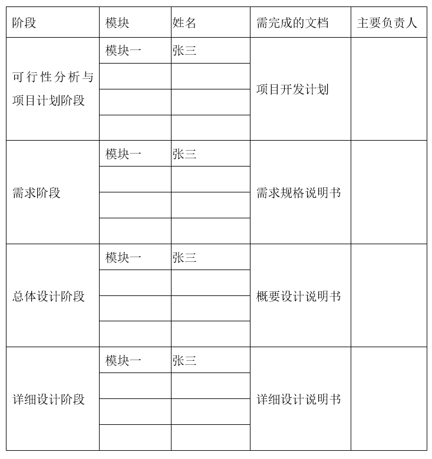
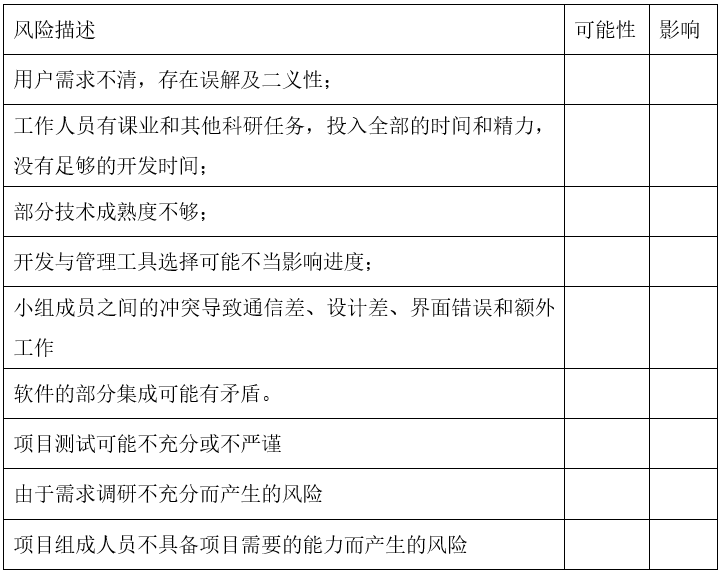

# 项目开发计划

## 1.引言

### 1.1 标识（必填）
系统名称：在线医疗管理系统（OMMS）
缩略语：OMMS
版本号：v1.0（MVP）
发行号：2025.11
标识号：OMMS-2025-V1

### 1.2 项目背景
本系统面向医院/诊所的在线预约、就诊与病历管理、处方与药品库存、检验与报告、在线支付、报表统计与审计等全流程业务；采用前后端分离架构，支持患者、医生、护士、管理员四类角色；强调数据安全与合规。
项目性质为课程项目的工程化实践，首次迭代交付 MVP；投资方/需方为教学场景，用户为患者与医护人员及管理员；开发方为项目组，支持机构为学院实验室。
运行现场规划 dev/test/prod 环境；MVP 阶段单机部署（后端+MySQL）。相关文档包含选题说明、需求说明、API 规范与测试计划等。

### 1.3 定义
术语与缩略语：
PII：可识别个人信息；RBAC：基于角色的访问控制；JWT：JSON Web Token；E2E：端到端测试；SLA：服务级别协议；RTO：恢复时间目标；RPO：恢复点目标；幂等：同一操作重复执行结果一致；Idempotency-Key：幂等请求键；P95：95 分位响应时间；QPS：每秒查询数；MVP：最小可行产品；CI/CD：持续集成/持续交付。

### 1.4 引用文件
《选题说明》：/d:/Desktop/学科/软件工程/在线医疗管理系统/选题.md
《API 规范（v1）》：路径前缀 /api/v1，统一响应格式与授权策略（见选题说明）
《测试计划》：覆盖目标与发布准入（见选题说明）
《安全与合规》：数据分类、加密、授权与审计策略（见选题说明）

## 2.项目概述

### 2.1 总体功能（必填）
主要功能：
用户与角色管理（患者/医生/护士/管理员）
预约管理（排班、在线预约、提醒、状态跟踪）
病历管理（病史、报告、诊断、处方，授权共享）
住院管理（病房分配、住院记录、出院结算）
药品与库存（信息管理、库存监控、处方发药）
在线支付（费用清单、支付与记录导出）
检查与检验（申请、结果上传、历史查询）
报表与统计（就诊/收入/药品使用统计与导出）
通知与消息中心（系统通知、预约与结果提醒）
系统安全与日志（加密、审计、备份与恢复）

### 2.2 产品
交付物：
软件产品：后端服务、前端 SPA、部署与备份脚本（MVP）
技术文档：用户手册、安装手册、API 文档、数据库设计说明、测试报告

### 2.2.1 程序
后端：Java 21 + Spring Boot 3.2.x，Spring Security、Spring Data JPA/MyBatis，JWT 认证，MySQL 8.0
前端：Vue 3 + Ant Design Vue 4.x，Vue Router 4.x，Axios，ECharts

### 2.2.2 文档
用户手册（按角色）
安装与部署手册（dev/test/prod）
API 与接口安全手册（/api/v1，认证授权、幂等与重试）
数据库设计与编号规则说明（预约号、处方号、检验单号）
测试计划与测试报告（单元/集成/E2E/UAT）
运维与灾备手册（备份策略与恢复演练）

### 2.3 可行性分析
技术可行性：选型成熟稳定，后端与前端生态完善；支付使用微信/支付宝沙箱；缓存与水平扩展可支持目标容量。
时间可行性：双周迭代，6–8 周可交付 MVP；每日站会与看板跟踪确保节奏稳定。
成本可行性：单机部署，使用开源组件与沙箱通道，硬件与外部成本低。
主要风险与缓解：
合规与隐私（最小必要原则、脱敏与加密）；支付对账与幂等（签名校验、回调幂等更新）；性能容量（缓存热数据、异步化、分页与筛选统一）；数据可靠性（备份与灾备演练）。

### 2.4 运行环境
软件工程环境：Ubuntu 22.04 LTS + Bash，OpenJDK 21，Node.js 18，MySQL 8.0，Git，构建工具（Maven/Gradle），包管理（npm）
软件测试环境：dev/test 分离；支付通道使用沙箱；测试数据脱敏与构造规范
软件开发库：代码仓分支 main/dev；依赖与版本管理；统一代码规范与检查
软件开发文档：本计划、选题说明、API 规范、安全与合规、测试计划
非交付软件：监控与日志查看工具、数据库客户端、接口调试工具

### 2.5 服务
部署服务：提供环境搭建与部署指南、脚本与配置说明
维护服务：缺陷修复、版本升级与数据迁移支持
培训服务：管理员与医护角色的使用培训与操作手册讲解
运维支持：备份策略实施、恢复演练、监控与告警配置

### 2.6 验收标准
功能验收：十个模块的核心功能可用，流程闭环（预约→就诊→处方/检验→支付/对账→报表/审计）
性能与容量：单实例 QPS≥200；P95 响应 < 400ms；并发在线用户 500；日预约量 5,000
可用性与可靠性：工作时段 SLA≥99.5%；关键流程降级与告警可用；备份与恢复策略可行
安全与合规：传输层 TLS1.2+；静态敏感字段加密；密码哈希 BCrypt；RBAC 与行级访问限制；审计日志留存策略达标
测试准入：单元测试覆盖率 ≥60%；关键流程 E2E 用例 ≥8；回归测试通过；关键缺陷清零
文档交付：用户、安装、API、数据库、测试与运维文档完整

### 2.7 完成项目的最迟期限
最迟完成期限：2026-01-31（基于 4 个双周迭代，含 UAT 与发布）

### 2.8 本计划的批准者和批准日期
批准者：项目负责人
批准日期：2025-11-14

## 3.实施计划

### 3.1 软件开发模型（必填）
采用迭代增量模型（双周迭代）+ 看板管理 + CI/CD。
原因：业务模块多且相互关联，迭代能快速交付可用增量并收集反馈；配合自动化测试与持续集成提高交付质量。

### 3.2 任务分解（必填）

阶段与任务：
可行性分析 → 需求梳理与范围界定 → 总体设计（架构、数据模型、API 规范） → 详细设计（模块与接口）
后端实现（用户/权限、预约、病历、处方与库存、检验、支付与对账、报表、通知、审计与日志）
前端实现（角色界面、预约流程、病历与处方、检验结果、支付页面、报表与可视化、消息中心）
联调与集成测试 → 性能与安全加固 → 部署与数据初始化 → 培训与验收

### 3.3 项目开发进度（必填）

写明可行性分析阶段、需求阶段、总体设计阶段和详细设计阶段各阶段的起止日期

迭代安排：
迭代 0（2025-11-14 ~ 2025-11-21）：环境搭建、可行性与需求细化、数据模型与编号规则确认
迭代 1（2025-11-24 ~ 2025-12-05）：用户管理与认证授权、预约基础流程、统一响应与分页筛选
迭代 2（2025-12-08 ~ 2025-12-19）：病历与处方、药品库存与发药、消息通知、报表基础
迭代 3（2025-12-22 ~ 2026-01-02）：检验申请与结果上传、支付沙箱集成与对账、审计与日志完善
迭代 4（2026-01-05 ~ 2026-01-16）：系统联调、性能优化与降级策略、UAT 与验收、发布与备份演练
节奏：周一需求评审与任务拆分；周五迭代演示与验收；每日站会与看板跟踪。

### 3.4 关键问题

影响整个项目成败的关键问题、技术难点和风险包括以下因素：

关键问题与风险：
数据安全与合规（最小必要、脱敏与加密、日志留存与删除策略）
认证授权与数据隔离（RBAC + 作用域控制，医生/护士行级访问限制）
接口幂等与支付对账（Idempotency-Key、签名校验、回调幂等更新与异常订单处理）
性能与容量（缓存热数据、水平扩展、队列与异步化、统一筛选与分页）
可用性与灾备（备份策略、跨机房/云存储外置备份、恢复演练与目标）
审计与告警（关键操作记录、阈值告警、日报与监控项）

## 4.人员组织及分工

### 4.1 组织结构
组织结构：项目负责人（总体把控与架构决策）；后端组（服务与数据库与安全）；前端组（UI 与交互与可视化）；测试/QA 组（用例与自动化与性能与安全）；运维组（部署与监控与备份），必要时合规支持。
权限与职责：各组对各自模块的设计、实现、测试与交付负责；跨组接口通过 API 规范协同；发布由负责人与 QA 共同批准。

### 4.2 人员分工和职责
后端：认证与授权（JWT、RBAC）、统一响应与错误码、核心业务接口（预约/病历/处方/库存/检验/支付/报表）、审计与日志、备份与恢复
前端：角色门户与导航、预约流程与提醒、病历与处方录入与展示、检验结果查看、支付页面与记录导出、统计图表与报表、消息中心
测试/QA：单元/集成/E2E/UAT 测试用例与自动化、性能基线与回归、发布准入
运维：环境搭建、CI/CD、监控与告警、备份与灾备演练、日志管理与留存策略落实
